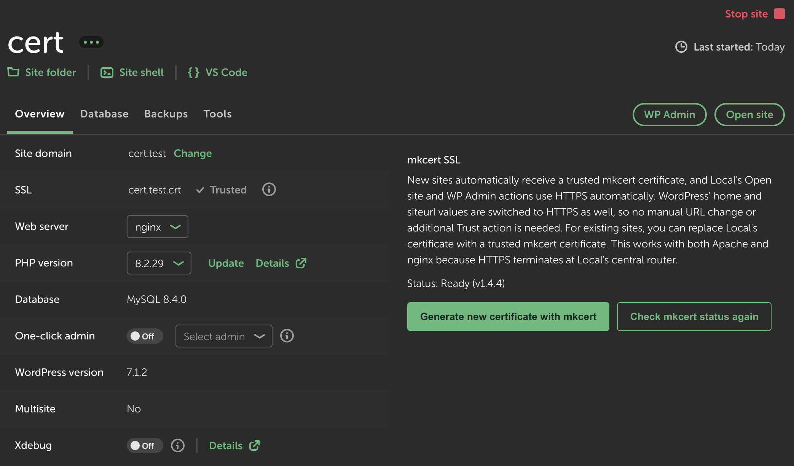

# mkcert SSL for Local

A macOS add-on for [Local](https://localwp.com/) that automatically creates locally trusted
TLS certificates with [mkcert](https://github.com/FiloSottile/mkcert).

The add-on replaces the certificate and private key used by Local's central router. It works
with both Apache and nginx sites because HTTPS terminates at the router before requests are
proxied to the site's web server.

Without this add-on, using HTTPS for a Local WordPress site can require manually trusting
Local's certificate in macOS Keychain Access and changing WordPress's `home` and `siteurl`
values to `https://`. After the one-time mkcert setup, **mkcert SSL handles both steps
automatically** for new sites: the certificate is already trusted and the WordPress URLs are
updated, so no manual Keychain or URL changes are needed.

## Features

- Automatically creates a certificate when Local fires the `siteAdded` action.
- Provides a manual **Generate new certificate with mkcert** action on every Site Overview.
- Detects mkcert from `PATH`, Homebrew on Intel or Apple Silicon, and MacPorts.
- Checks for the mkcert root CA and its matching certificate in the macOS Keychain.
- Calls external programs with `execFile` and argument arrays, never through a shell.
- Validates domains before using them in paths or process arguments.
- Covers the primary domain, its wildcard, loopback names, and Local multisite domains.
- Generates and validates files in a temporary directory before replacing router files.
- Preserves Local's original files once as `.local-original`.
- Serializes operations so simultaneous site creation cannot race.
- Refreshes the router configuration and safely reloads the existing nginx master process.
- Marks successfully configured sites as HTTPS-ready through Local's supported `customOptions`
  data and makes Local's **Open site** and **WP Admin** actions use `https://`.
- Updates WordPress `home` and `siteurl` to their HTTPS equivalents through Local's WP-CLI
  service, preserving the configured host and path.
- Clears stale Local SSL trust warnings after a successful mkcert installation.
- Writes structured messages to Local's log and displays actionable errors in the UI.

## Example in Local

After setup, Local shows the mkcert certificate as trusted and its built-in site actions use
HTTPS without an additional Trust action:



## Requirements

- macOS
- Local 9 or later
- mkcert
- Node.js 22.12 or later only when building from source

Install and initialize mkcert once:

```sh
brew install mkcert
mkcert -install
```

Firefox may use its own certificate store. If Firefox does not trust generated certificates:

```sh
brew install nss
mkcert -install
```

> [!WARNING]
> Never share or commit mkcert's `rootCA-key.pem`. Anyone who obtains it can issue
> certificates trusted by your machine.

## Install in Local

Download `local-addon-mkcert-<version>.tgz` from the
[latest GitHub release](https://github.com/electricarts/local-addon-mkcert/releases/latest).

In Local:

1. Open **Add-ons**.
2. Choose **Install from disk**.
3. Select the downloaded `.tgz`.
4. Restart Local and enable **mkcert SSL** if necessary.

### Install from source

```sh
npm install
npm run build
ln -s "/absolute/path/to/local-addon-mkcert" \
  "$HOME/Library/Application Support/Local/addons/local-addon-mkcert"
```

Restart Local after creating the link.

## Usage

### Automatic

When a site is added, the add-on writes:

```text
~/Library/Application Support/Local/run/router/nginx/certs/<domain>.crt
~/Library/Application Support/Local/run/router/nginx/certs/<domain>.key
```

It then refreshes Local's router configuration and asks the running nginx master process to
reload it. If the router is not running, the certificate is installed without an error and is
loaded the next time Local starts the router. After a successful installation, the add-on stores
its own HTTPS-ready marker in Local's `customOptions` object. Local's built-in **Open site** and
**WP Admin** actions then use `https://` automatically. The add-on also updates WordPress'
`home` and `siteurl` options to HTTPS through Local's WP-CLI service, so no manual change in the
WordPress admin area is required. Only the protocol is changed; the configured host, path, and
trailing slash are preserved. If WordPress is not ready when the automatic hook runs, the UI
reports that separately and the manual action can be run again after the site is ready.

### Manual

Open a site and find **mkcert SSL** on the **Overview** screen. When the status is **Ready**,
choose **Generate new certificate with mkcert**.

## Verify an installation

1. Create a site such as `mkcert-test.local`.
2. Click Local's **Open site** and **WP Admin** buttons and confirm they open `https://` URLs.
3. In WordPress, open **Settings → General** and confirm both **WordPress Address (URL)** and
   **Site Address (URL)** use `https://`.
4. Open the site in Safari or Chrome and inspect the served certificate.
5. Confirm that the issuer is **mkcert development CA**.
6. Confirm that the browser shows no certificate warning.
7. Repeat with one Apache and one nginx site if both environments are available.

Local log messages include:

```text
"addon": "mkcert-ssl"
```

## Restore Local's original certificate

The first replacement preserves Local's files as:

```text
<domain>.crt.local-original
<domain>.key.local-original
```

Disable the add-on, quit Local, restore those files to their original `.crt` and `.key` names,
and restart Local.

## Development

```sh
npm ci
npm run typecheck
npm test
```

The project is built against `@getflywheel/local` 10.1.1. See
[RISKS.md](RISKS.md) for compatibility details and [CONTRIBUTING.md](CONTRIBUTING.md) before
submitting a change.

## Support and security

- Report reproducible bugs through [GitHub Issues](https://github.com/electricarts/local-addon-mkcert/issues).
- Do not disclose security vulnerabilities in a public issue. Follow [SECURITY.md](SECURITY.md).

## License

[MIT](LICENSE)

This project is not affiliated with or endorsed by WP Engine, Flywheel, or the mkcert project.
